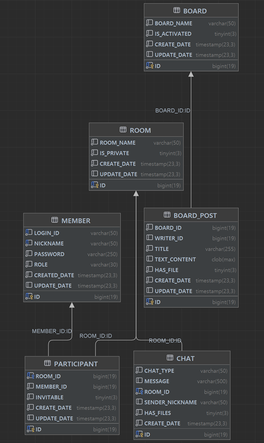

# Spring Chat Application
## 프로젝트 개요
이 프로젝트는 Spring Boot를 기반으로 한 채팅 애플리케이션입니다. 
포트폴리오 성격의 프로젝트입니다.

## 주요 기능
- 사용자 인증 및 권한 관리
- 실시간 채팅
- 채팅방 생성 및 관리
- 메시지 전송 및 수신

## 기술 스택
- Backend: Spring Boot, Spring MVC, Spring Security, Spring Data JPA, JWT, Thymeleaf
- Database: MySQL, Redis
- Messaging: Kafka, WebSocket
- Documentation: Spring REST Docs
- API Communication: WebClient

## API 문서
- [웹 페이지 API](https://hamalade.github.io/spring_chat/)

## 프로젝트 구조

### 웹 어플리케이션 구조
```
app/
└── src/
    └── main/
        └── java/
            └── com/
                └── hs/
                    ├── application/
                    │   ├── auth/
                    │   ├── board/
                    │   ├── member/
                    │   └── room/
                    ├── persistence/
                    │   ├── entity/
                    │   └── repository/
                    └── presentation/
                        ├── auth/
                        ├── board/
                        ├── chat/
                        ├── error/
                        ├── exception/
                        └── home/
websocket/
└── src/
    └── main/
        └── java/
            └── com/
                └── hs/
                    ├── application/
                    │   ├── chat/
                    │   └── websocket/
                    ├── persistence/
                    └── presentation/
                        └── chat/
```

### 데이터베이스 구조


### 배포중인 AWS ECS 구조


## 새로운 기술 도입 및 학습

### Kafka
- 도입 이유: 업계에서 널리 사용되는 기술을 경험하고 학습하기 위해 선택
- 사용 목적: 두 서버 간의 비동기 메시지 큐로 활용
- 학습 포인트: 분산 시스템에서의 메시지 처리

### WebSocket
- 도입 이유: 실시간 양방향 통신이 필요한 채팅 기능 구현을 위해 선택
- 기존 경험 기술 SSE와의 비교: 더 다양한 실시간 기능 구현 가능성 고려
- 학습 포인트: 실시간 통신 프로토콜, 클라이언트-서버 간 지속적 연결 관리

## 개발 과정에서의 도전과 학습
1. 비동기 처리: 실시간 채팅 구현 과정에서 비동기 상황 처리
2. 프로젝트 범위 조정: 초기 계획을 축소하여 핵심 기능에 집중, 프로젝트 관리 능력 향상
3. 개인정보: 최소한의 개인정보만을 저장하고 관리하는 방식으로 설계, 법적 보안문제 고려
4. 클라우드 배포 고려: AWS 배포 준비 과정에서 리소스 관리와 비용 최적화에 대한 학습
5. API 문서화: Spring REST Docs를 통한 API 문서 작성, 문서화의 중요성 인지

## 이슈, 해결 및 추가 계획
- 트레픽에 따른 스케일 아웃을 위해서는 Redis와 Kafka는 클러스터 구성이 필요한데, 현재는 단일 서버로 운영 중
  - 이 부분은 비용 문제가 있으므로 단일 구성이 유지될 예정
- 이미지 저장 및 전송 기능은 사이트의 가입 및 사용자 수가 늘어나면 비용이 증가할 수 있음
  - 이 부분은 추가적인 비용을 고려하여 구현할 계획

## 추가 계획
- 채팅방 내 1:1 상호작용 기능 추가 (귓말, 친구 추가 등)
- 리소스 저장 기능 구현 (비용 효율적인 방식 고려)
